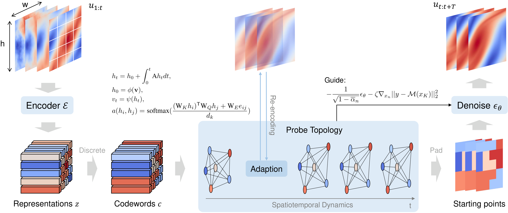

# 🌠 Sparse Diffusion Autoencoder for Test-time Adapting Prediction of Spatiotemporal Dynamics


Official implement of our **Neurips 2025** manuscript: 📄 *"Sparse Diffusion Autoencoder for Test-time Adapting Prediction of Spatiotemporal Dynamics"*

This repository contains the implementation of **SparseDiff**, a novel Sparse Diffusion Autoencoder that efficiently predicts spatiotemporal dynamics and dynamically self-adjusts at test-time.




## 🚀 Quick Start

### 📦 Required Dependencies

Ensure the following packages are installed before running the code:

```
pip install tqdm yaml torch torchdiffeq ema_pytorch torch_geometric torchmetrics vector_quantize_pytorch
```


### 🏃 Running the Model (Example: SH System)

1️⃣ **Download Dataset** 📂: [Proton Drive](https://drive.proton.me/urls/N82NDP08F0#8tnsb0S120iT)

Shape of the data:  (num_trajectories, steps, channel, x_dim, y_dim)

- uv.npy: (100, 100, 1, 128, 128)

- uv_test.npy: (50, 100, 1, 128, 128)

Please download data to the `./data/sh` directory. 

2️⃣ **Download model chekpoint** 📂: [Proton Drive](https://drive.proton.me/urls/N82NDP08F0#8tnsb0S120iT)

We have three models: Sparse Encoder, Diffusive Predictor and Unconditioned diffusion.

Please download ***grand_input_10_256_1.pth*** (the predictor model weights), ***vqvae_T_10_ae_pretrain_30_32_32.pth*** (the sparse encoder model weights) and ***model_999.pth*** (the diffusion model weights) to the `./log/sh` directory. 

3️⃣ **Run the model** :

After downloading the data and model weights, you can directly run ***sample_sh.ipynb*** to get the iterative prediction result for SH system! ✅


4️⃣ **Train the model**:

If you want to re-train the model, you can run train_sh.py with commands:

- For Single GPU / CPU:

  ```sh
  python train_sh.py
  ```

- For Multi-GPU (with AMP support):

  ```sh
  python -m torch.distributed.run --master_port=25640 --nproc_per_node=8 train_sh.py --use_amp --multi_gpu --system sh
  ```


## 📁 Repository Structure

```sh
.
├── README.md
├── config
│   └── SH.yaml
├── datasets.py
├── model
│   ├── __init__.py
│   ├── block.py
│   ├── common.py
│   ├── DDPM.py
│   ├── grand_predictor.py
│   ├── unet.py
│   └── vq_vae.py
├── log
│   ├── sh
│   │   ├── grand_input_10_256_1.pth
│   │   ├── vqvae_T_10_ae_pretrain_30_32_32.pth
│   │   └── model_999.pth 
├── data
│   ├── sh
│   │   ├── uv.npy
│   │   └── uv_test.npy
├── train_sh.py
├── sample_sh.ipynb
├── datasets.py
└── utils.py
```


## 📌 Notes

- This implementation provides a **demo using the SH system** as an example. (Full version will be released after acceptance)
- Supports **both single-GPU and multi-GPU training**.
- Configuration files are stored in the `config/` directory.
- For questions regarding reproducibility or additional details, please refer to our manuscript.
